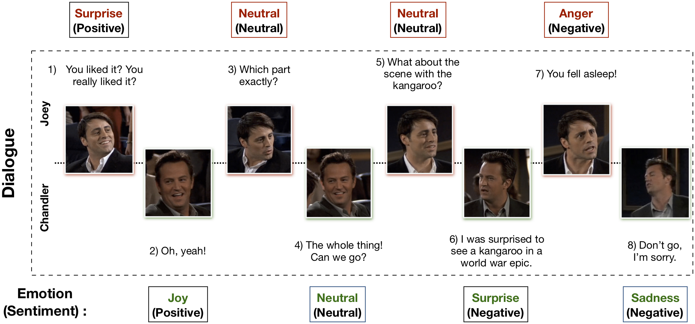

# Installment

1. donwloading file folder 'custom-gym'
2. entering path of 'custom-gym'
    ```cmd
    cd path/into/custom-gym
    ```
3. installing 'MELD' with pip command:
    ```cmd
    pip install -e .
    ```

# The environment

## Env
This env is a simple case of converting [MELD](https://github.com/declare-lab/MELD/tree/master) dataset into reinforcement learning (RL) environment that can be interacted with. Additionally, emotion labels are converted into several emotional embedding spaces for continuous emotion labels.

- **Actions**: Estimated emotion embedding of time $t$ (e.g. $g(\hat{e_t})$).
- **States**: Audio (features) and utterance (features) of $t+1$.
- **Reward**: Sum of cosine distance between $g(\hat{e_t})$ and embedding of true label $g(e_t)$.
  
Embdedding spaces are chosen from:
  - **w2v**: Using neural network [Word2Vec](https://radimrehurek.com/gensim/models/word2vec.html) model to convert emotion labels into corresponding language semantic space as continuouse values. In shape of (300, ).
  - **glove**: Using conting based model [glove](https://radimrehurek.com/gensim/scripts/glove2word2vec.html) to convert emotion labels into corresponding language semantic space as continuouse values. In shape of (50, ).
  - **NRC_VAD**: Using extended version of [Valence-Arousal-Domain lexicon](https://saifmohammad.com/WebPages/nrc-vad.html) to convert emotion labels into manually predefined space as continuous values. In shape of (3, ), which are valence-dim, arousal-dim and domain-dim.

❗ Especially, w2v and glove don't have finite scale while NRC_VAD are scaled within [0,1] 
 
## Dataset


For details, please check the official document of [MELD](https://github.com/declare-lab/MELD/tree/master). This dataset contain several dialogue from TV series "Friends". And each dialogue contain several consecutive utterances (didn't group by characters) with emotion labels.

Emotion labels contain seven categories ```['anger', 'joy', 'sadness', 'surprise', 'fear', 'disgust', 'neutral']```

Here we utilized two types of dataset from MELD.
   - **Raw Data** ([download](https://web.eecs.umich.edu/~mihalcea/downloads/MELD.Raw.tar.gz)):
     - There are 3 folders (.tar.gz files)-train, dev and test; each of which corresponds to video clips from the utterances in the 3 .csv files.
     - In any folder, each video clip in the raw data corresponds to one utterance in the corresponding .csv file. The video clips are named in the format: dia{X1}_utt{X2}.mp4, where {X1} is the Dialogue_ID and {X2} is the Utterance_ID as provided in the corresponding .csv file, denoting the particular utterance.
     - For example, consider the video clip dia6_utt1.mp4 in train.tar.gz. The corresponding utterance for this video clip will be in the file train_sent_emp.csv with Dialogue_ID=6 and Utterance_ID=1, which is 'You liked it? You really liked it?'
 
   - **Predefined Features** ([download](https://web.eecs.umich.edu/~mihalcea/downloads/MELD.Features.Models.tar.gz))
    Still, details in [MELD](https://github.com/declare-lab/MELD/tree/master) document. Here we only utilized audio features from [openSMILE](https://www.audeering.com/opensmile/) and text features from glove. 
    For emotion recognition task(different from sentiment recognition task), features for each modality are in shape of:
        - Utterance modality: (300, ) each utterance extracted from the average of the Glove embeddings of all tokens per utterance.
        - Audio modality: (1611, ) each corresponding utterance. These features are originally extracted from [openSMILE](https://www.audeering.com/opensmile/) and then followed by L2-based feature selection using SVM.
## Data Preparation (only for raw data)
Since the raw data doesn't  contain pure wav files, you need to run crop.py to extract audio files (.wav) from video files (.mp4):

```
python crop.py --path {$path/to/video_files}
```
where ```{$path/to/video_files}``` is the path directly toward file folder of specific partition. e.g. if you want to crop audio for testing data, then ```{$path/to/video_files}``` should be 'xxx/MELD.Raw/test'. And extracted audio files will be stored with the same name of original video file.

    dia0_utt0.mp4 --crop.py--> dia0_utt0.mp4, dia0_utt0.wav
  
#  Uasge
## Initialziation
There are five arguments that can be passed into ```gym.make()``` are used to control the environment. 
  - ```{$dataset_path}```: Path toward dataset. (e.g. for raw data, it should be ```'path/to/MELD.Raw'```, and for predefined feature, it should be ```'path/to/MELD.Features.Models/features'```).
  - ```{$partition}```: Used to indicate dataset partition. Should be within the list of ```['train', 'test', 'dev']```.
  - ```{$label_emb}```: Used to indicate emotion embedding space. Should be choose from ```['w2v', 'glove', 'NRC_VAD']```.
  - ```{$w2v_path}```: Path toward gensim w2v or glove model files. If doesn't be declared, env will download a moedl file from [gensim](https://radimrehurek.com/gensim/models/word2vec.html). Only operate with ```label_emb = w2v```
  - ```{$predefined_feat}```: Boolen value. Indicator of whether to load predefined feature. 

An example of loading a env for testing data with predefined features as states and using NRC_VAD as the emotion embedding space:
```Python
import gym
import MELD
env = gym.make('MELD-v0',
               dataset_path='MELD.Features.Models/features',
               partition='test',
               label_emb='NRC_VAD',
               predefined_feat=True)
```
## Step
Return a six-element-tuple of following contents: 

    Return: 
        (   
            (utterance (feature) of next timestep, audio (feature) of next timestep),
            flag to indicate whether current dialogue has been finished,
            dialogue_utterance index pair,
            text emotion label,
            corresponding emotion embedding,
            reward of current action
        )

❗ When dialogue flag *(second element)* is True, you should call reset method manually.

## Reset
Two arguments are optional:

  -  ```{$dia_id}```: Manually choose ```{$dia_id}```-th dialogue.
  - ```{$utt_ptr}```: Manually choose ```{$utt_ptr}```-th utterance of ```{$dia_id}```-th dialogue.

If not indicate explicitly, env will randomly choose a dialogue and start from the first utterance.

Return similiar structure of ```step()``` but with emotion label, emotion embedding and reward as ```None``` since the emotion and the rewards are always one-step delayed to the utterance and the audio in returned tuples.

##  Important members

- **self.partition** str: 
Dataset partition.
- **self.dia_id** (int): 
Index of dialogues.
- **self.utt_id** (str): 
Index of utterance.
- **self.dia_utt** (dict of list): 
Keys are ```dia_id``` and values are list of correspond ```utt_id``` 
- **self.label_dict** (dict of np.ndarray): 
Keys are emotion labels and values are corresponding embedding given an embedding space.
- **self.dia_flag** (bool): 
Indicator of whether utterances in the current dialogue has be traversed.
- **self.label/self.utt/self.audio** (dict):
Dictionaries of data. Keys are dia_utt index pair. e.g. to call the label of 0-th dialogue and 0-th utterance, using ```env.label['0_0']```

❗ Following members are mainly used to satisfiy the rule of customed environments for ```gym```. They don't literally mean the input and output of ```step()``` and ```reset()```
- **self.observation_space**:
    ```gym.spaces.Dict``` consisting of:

            'utt_idx': gym.spaces.Discrete,
            'audio_idx': gym.spaces.Dict(
                gym.spaces.Discrete with size of utterance number for each dialogue
            )
- **self.action_space**:
    ```gym.spaces.Discrete``` with size of shape of emotion embedding sapce (300, 50 or 3)
